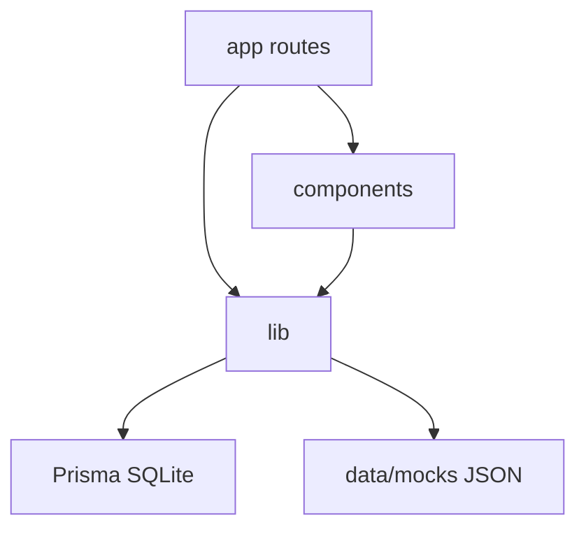
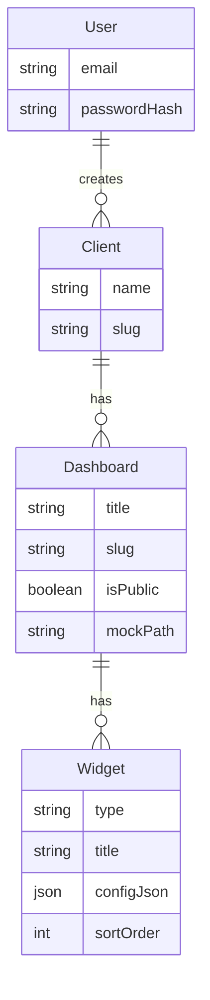

# Architecture Spine — BBDash MVP

## Design Paradigm

**Layered modular monolith** no Next.js App Router:

- `app/` — HTTP boundaries (pages, route handlers)
- `components/` — UI (admin, dashboard viewer, filters, widgets)
- `lib/` — domínio puro (auth helpers, prisma, filter-engine, mock-loader)
- `data/mocks/` — Datasets JSON (fora do domínio de UI)

Dependências só para baixo: `app` → `components`/`lib` → `prisma`/`fs`. Widgets não acessam Prisma.



## Invariants & Rules

### AD-1 — Modular monolith [ADOPTED]

- **Binds:** all
- **Prevents:** split prematuro admin/public em dois deploys
- **Rule:** Admin e URL Pública vivem no mesmo app Next.js.

### AD-2 — Auth boundary [ADOPTED]

- **Binds:** FR-1, FR-2, FR-17–19
- **Prevents:** vazamento de mutação no viewer público
- **Rule:** Middleware exige sessão em `/admin/*`. `/p/*` é anônimo e read-only. Mutations só via Server Actions autenticadas.

### AD-3 — Ownership de dados [ADOPTED]

- **Binds:** FR-3–9
- **Prevents:** métricas embutidas no schema Prisma
- **Rule:** Prisma ownership: User, Client, Dashboard, Widget. Métricas/dimensões vêm do Dataset JSON referenciado por `Dashboard.mockPath`.

### AD-4 — Filter engine puro [ADOPTED]

- **Binds:** FR-10–16
- **Prevents:** cada Widget filtrar de forma inconsistente
- **Rule:** `filterDataset(rows, filters) → rows` é função pura; Widgets recebem só rows já filtradas (e opcionalmente comparison rows).

### AD-5 — Indicadores flutuantes [ADOPTED]

- **Binds:** FR-7
- **Prevents:** hardcode Visitantes/Sessões/Conversões no código
- **Rule:** Widget `configJson` referencia nomes de campos do schema do Dataset; nenhum KPI de negócio é constante de produto.

### AD-6 — Cascade delete [ADOPTED]

- **Binds:** FR-5, FR-9
- **Prevents:** órfãos Dashboard/Widget
- **Rule:** `onDelete: Cascade` Client→Dashboard→Widget.

## Consistency Conventions

| Concern | Convention |
| --- | --- |
| Naming | Entities PascalCase Prisma; slugs kebab-case; files kebab-case |
| IDs | cuid Prisma |
| Dates | ISO `YYYY-MM-DD` no Dataset; filtros em UTC local day |
| Errors | Server Actions retornam `{ ok: false, error: string }` |
| Auth | NextAuth Credentials; senha bcrypt |
| Brand | CSS vars `--bb-accent #DA9330`, `--bb-black #141312`, `--bb-gray #B1B0B1`, `--bb-cream #F4F0ED` |

## Stack

| Name | Version |
| --- | --- |
| Node.js | 20.x |
| Next.js | 15.x |
| React | 19.x |
| TypeScript | 5.x |
| Tailwind CSS | 3.x |
| Prisma | 6.x |
| SQLite | via Prisma |
| next-auth | 4.x (Credentials) |
| bcryptjs | latest |
| Recharts | 2.x |
| zod | 3.x |

## Structural Seed

```text
bbdash/
  prisma/schema.prisma
  prisma/seed.ts
  data/mocks/*.json
  src/
    app/
      layout.tsx
      page.tsx
      login/page.tsx
      admin/...
      p/[clientSlug]/[dashboardSlug]/page.tsx
      api/auth/[...nextauth]/route.ts
    components/
      admin/
      dashboard/
      ui/
    lib/
      auth.ts
      prisma.ts
      filter-engine.ts
      mock-loader.ts
      slug.ts
```



## Capability → Architecture Map

| Capability | Lives in | Governed by |
| --- | --- | --- |
| Auth FR-1..2 | `lib/auth`, middleware, `/login` | AD-2 |
| Clients FR-3..5 | `app/admin/clients`, Server Actions | AD-3, AD-6 |
| Dashboards FR-6..9 | `app/admin/.../dashboards` | AD-3, AD-5 |
| Filters FR-10..16 | `lib/filter-engine`, `components/dashboard/filters` | AD-4 |
| Public FR-17..19 | `app/p/...` | AD-2 |
| Brand FR-20 | `globals.css`, Tailwind theme | Conventions |

## Deferred

- BigQuery connector (v2) — Dataset abstrato além de JSON
- Geração IA de widgets (v2)
- Postgres / deploy produção / domínio custom
- Roles além de Usuário Interno único
- Export CSV/PDF
